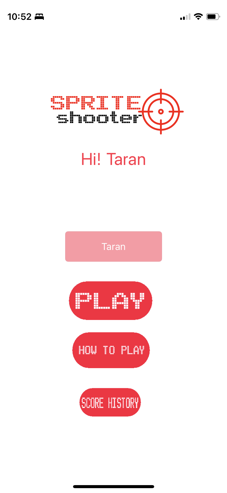

# sprite_shooter
:warning: Watch the video (File name: video.mp4)
## Description:
I have built a challenge-based Augmented Reality shooting game using ARKit and written in Swift. I added 2D/3D elements to the live view from the device’s camera, making those elements appear to inhabit the real world. The gameplay is simple, just look around you and shoot every enemy!

The score is stored using <strong> Firebase </strong>. This allows users to compete against their highest score. With this app you can convert any environment like park, library, restaurant (the limit is your imagination!) into a real world game.
## Design & Implementation: 
I used ARKit to combine device motion tracking, camera scene capture, advanced scene processing, and display conveniences, simplifying the task of building an AR experience. To enhance the gaming experience, I added sound effects and background music using AVPlayer. The app also contains multiple classes for various functionalities, including ARSKView, ARSession, ARFrame, ARAnchor, and SpriteKit (SKScene, SKSpriteNode, SKAction, SKNode). I utilized Cocoapods for managing external libraries.

:bulb:IMP: Make sure that .plist files are updated, I have deleted the content for security reasons

:bulb:IMP: How to setup firebase: https://firebase.google.com/docs/ios/setup 

</img>
</img>
</img>
